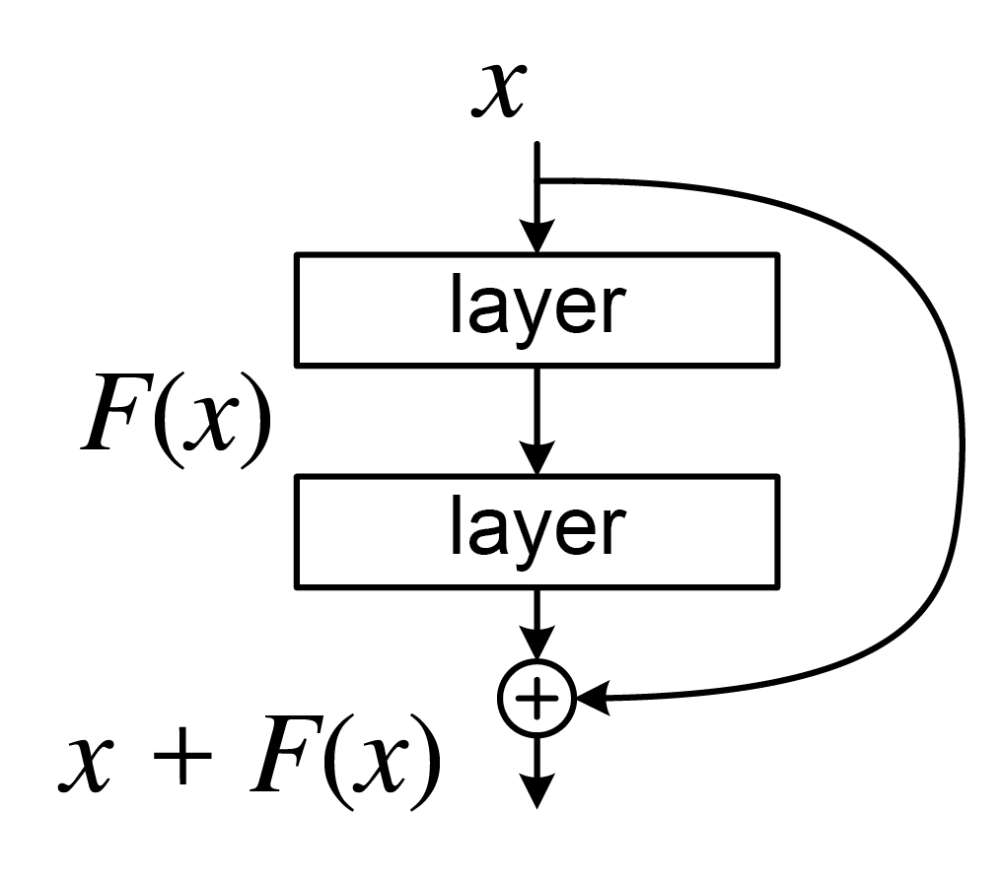

```
Author: Cfir Hadar

Tags: Done
```
# Lesson 03 - Convolutional Neural Networks
## Convolutional Layers

### Motivation

A common problem in a lot of domains is classifying what we see in an image.
Let's consider the classification problem of gray-scale images of size $1024\times1024\times1$ into a 100 different categories.

Until now we discussed about fully connected neural networks, that is when every neuron is connected to all the neurons in the layer before it, and to all the neurons in the layer after it. 

The naive approach to classify our images would have been training a fully-connected network (FCN) to sort them.
Each image can be fed into our model as an input and the model will output a vector representing how likely the image is to belong to each of the 100 categories we have. Even without any hidden layers, the number of parameters in this network is $1024^2\cdot100 + 100=104,857,700$ (adding the number of weights and biases) which to say the least is a lot and will take relatively long time to compute a prediction on all of our images.

These networks are very "expressive", because we do not constrain the network at all. "With greater power comes great responsibility" as these are computationally expensive. 

Solution: 
Constrain the expressiveness of the network using some 'outside' information. 
As humans we think of image pixels as locally related, that is: close pixels are strongly related, while far pixels less so. 
We will try to use this observation in our model to make it more efficient.

In order to use this concept of locality of pixels we will contract a new tool called a Convolutional Layer.
Let's say the model is "interested" in getting all the edges in our image as part of its classification process. How would he do that? One approach is taking a "filter" with the following weights:

| $-1$ | $0$ | $1$ |
| ---- | --- | --- |
| $-1$ | $0$ | $1$ |
| $-1$ | $0$ | $1$ |
and for each pixel (and its neighbors) it will apply this filter by multiplying each number in the weights table with the brightness of the pixel it is covering, and then, add up all these numbers. This gives a single number that indicates how much of an edge the center pixel is.


After applying this filter on each pixel in the image we will get another (slightly smaller) image with some useful information the model can use moving forward.


Analogous to layers in FCN, convolutional layers perform multiple of these convolution processes using different filters.

The special thing about convolution neural networks (CNNs) is their use of these convolutions as their basic building blocks.

### Formally

Convolutional layers performs a linear convolution, which is a cross-correlation computation between the given input and learnable kernels (what was referred until now as filters).

$$
y[n] = \sum_{m=1}^{K-1}{x[n-m]\cdot w[m]}, 
$$

whereas, $x\in\mathbb{R}^n, w\in\mathbb{R}^K$ are the input vector and weights vector respectively, and a single kernel ($w$) contains $K$ parameters ($K \ll N_{input}\times N_{output}$).

As we seen, we can extend this formulation to process images.

Usually, we use multiple different filters (concatenating the outputs of different filters), which ideally learn different sub-tasks.

As you can see, we used our everyday knowledge of images, such as locality, to improve our network architecture, resulting in a smarter model, with significantly less parameters.

Example: given an input image of size $6\times 6\times 3$, with two filters, each of size $2\times2\times3$.
Note that the filter's last dimension always equals to the last dimension of the input image, this dimension is referred to as channels (gray-scale images will have one channel: brightness. Color images will have three channels: red, green, and blue). Therefore, convolution consider a local environment in dimensions one and two, while considering **all** input channels at once.


Again, to break linearity, it is recommended to perform an element-wise nonlinear activation function on each output.

## Padding, Stride and Dilation

### Padding

One problem due to the locality of convolutions can be found in the edges of an image. naively ignoring this problem will result in a reduced dimensionality in the output image (smaller image comes out than the image going in). Padding aims to solve this phenomenon as it wraps the input image with a given symbol (usually zero, or duplicating edge values).


### Stride

Intuitively local information is very similar in neighbor pixels, therefore, to reduce the computational complexity, one may use a bigger stride (step size) for the filter movement.

For example, convolution with padding of one, and stride of two:


Note how the filter moves two pixels at a time, instead of one.

### Dilation (התרחבות)

In order to decrease even further in the number of computations, one may increase the filter dilation. For example, filter with dilation of
2.


## Computing Output Dimension

$$
O=\frac{I-K+2P}{S}+1,
$$

whereas, $I$ is the input dimension, $K$ is the kernel size, $P$ is the padding and $S$ is the stride size.

Number of output channels equals to the number of filters as discussed before.

## Receptive Field

Receptive Field is defined as the size of the region in the input that produces the feature.


See how the $5\times5$ image is compressed to a single pixel using two convolution layers, each with $3\times3$ kernel? Meaning, the receptive field of this network is $5\times5$.

## Pooling

Usually, in spectral data close elements carry similar values (e.g., close pixels usually have similar colors). We can utilize this to reduce even further the number of computation. To do so, pooling combines close pixels to a single value, reducing image dimension.

Pooling is usually carried out by averaging (Average Pooling) or taking the maximum value in the window (Max Pooling).


## Normalizations

Normalization of a set of items $\{x_i\}_{i=1}^N$ is,

$$
\tilde{x_i}\leftarrow\frac{x_i-\mu_x}{\sigma_x},
$$

where $\mu_x$ and $\sigma_x$ are the mean and standard deviation of $\{x_i\}_{i=1}^N$.

One can define the group $\{x_i\}_{i=1}^N$ as needed, but usually we define it to one of two options.

1. Batch Normalization (BN): works for each filter separately, using all outputs of that filter (one per input).
2. Layer Normalization (LN): works for each input separately, using outputs from all filters for that single input.


Note that both layer-norm and batch-norm are used in a single convolution layer.

## Famous CNN Architectures

### AlexNet


### VGG-16


$K\times K \text{ Conv+ReLU}\quad \text{no. of filters}$.

## Residual Networks (ResNet)
One of the challenges of using deep networks (networks with a lot of layers) is the optimization of such networks. In the backpropagation process, the gradients are computed from the last layer all the way back to the first one.
As the gradient propagate through the layers is can become very small (imagine that in each layer it is multiplied by a number less than 1), this makes the update of the layers insignificant, especially for the first ones.

To alleviate this problem we can "skip" some of the layers. This will allow the gradient to flow more directly through the network, making it easier for the model to learn.

Mathematically, we add a residual connection (a.k.a. skip connection) to layer $F$ with input $x$ simply by adding $x$ to the input:

$$
	y = F(x) + x
$$

Or visually,



This simple modification turns out to be extremely effective and allows training much deeper and much stronger networks like the ResNet with up to 152 layers!
(You can read more about ResNet in the paper [Deep Residual Learning for Image Recognition](https://openaccess.thecvf.com/content_cvpr_2016/html/He_Deep_Residual_Learning_CVPR_2016_paper.html))

## Walkthrough

[Walkthrough Chapter-02 Lesson-03](../walkthroughs/lesson3_cnn_cifar10.ipynb)

## Available Challenges

[Challenge 01 - CIFAR-10 with Limited Parameters](../challenges/challenge1_cifar10_limited-params.ipynb)

Please report your score in this [forms](https://docs.google.com/forms/d/e/1FAIpQLScjvrsJbfKVTwlvZk579ruwrbSbu84T4fakRzK3QD5vlifYdg/viewform).

You may see the scoreboard at this [link](https://docs.google.com/spreadsheets/d/1MLuPVBleyPGj8X_kqUYLfD8paDTicZevVuMRtfk_v10/edit#gid=1687672251).


