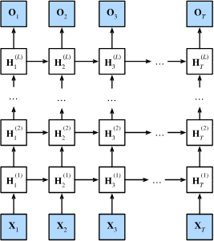

Author: Cfir Hadar

Tags: In Progress
# Lesson 4 - Recurrent Neural Networks
## Introduction

Sometimes data is structures as a time series, that is element after another, and the sequentiality is important for understanding the data, for example text, audio, video, DNA and more. Intuitively, data of this kind should be processed with a model that pay attention to this sequentiality. Additionally, note that both FCN and CNN require a fix and known maximal input dimension to function properly (i.e., without weird adaptations), but those modalities described (text, video, etc.) may require us to process practically unlimited sequences.

## Motivation from Cognitive Science

Let us dive deeper to a single example modality - text. Imagine reading a long sentence, consisting of different words, each is read one at a time. Note how our brain likes to process the current word using a hidden representation of the context (i.e., an aggregation of all previous words). We are going to try and incorporate this structure in our model architecture.

## Recurrent Neural Network

### Vanilla RNN

Assume we have the following input sequence $x_1,...,x_T$ (e.g., $x_t$ is a feature vector representing a word), and denote the cognitive hidden state of time $t-1$ as $h_{t-1}$. Our objective is twofold: 1) compute a new hidden state $h_t$, 2) compute an output vector $\hat{y}_t$.

Mathematically, we want to define two functions:

$$
h_t=H(h_{t-1},x_t)\\ \hat{y}_t=Y(h_t)
$$

This functions may be hard to find on our own, but we are data scientists, so we can just learn these functions (as long as we keep every thing differentiable).

Let us throw some learnable parameters to this mess:

$$
h_t=\phi_h(W_{hh}h_{t-1}+W_{xh}x_t)\\ \hat{y}_t=W_{hy}h_t
$$

whereas $\phi_h(\cdot)$ is an activation function, e.g., ReLU, Sigmoid, Tanh, etc.


Caption: here $A=W_{hy},B=W_{xh},C=W_{hh}$.

#### Extending to more Sophisticated Functions

As you might think, yes - you can extend this architecture to encapsulate more sophisticated functions. One immediate extension is to replace each $W$ with FCN.

#### Tasks

One to Many: given a single input, output a sequence, e.g., image captioning.

Many to One: given a sequence, output a single prediction, e.g., text sentiment analysis (i.e., tell if a conversation with customer service is bad or good).

Many to Many: given a sequence, out a sequence, e.g., language translation.


#### Gradient Flow

Let us examine the gradient flow in RNN for the rightmost many-to-many task. 


Denote by $L_t = \frac{1}{n}\sum_{i=1}^n{l(y_t^i,\hat{y}_t^i;\theta)}$ the loss at time $t$, whereas $l(\cdot;\theta)$ is the lost function tailored for the task objective (the ‘;’ denotes that $\theta$ is the model parameters, and are not the main inputs of the loss function, rather are used to compute the loss).

Note how $L_t$ contributes gradients to all calculations done until time $t$ (inclusive). This might cause a problem of vanishing gradients, where gradients becoming too small to handle.

Notice how we can calculate the derivative using the mighty chain rule, just multiply ‘local’ gradients on the path from a single loss, to a single parameter. This multiplication may result in vanishing or exploding gradients problem.

Vanishing Gradients:


In this example, we see that the derivation of the Sigmoid activation function is always $\le 1$, so multiplying many derivates may results in numbers so small, that they cannot be represented with traditional FP32 representations.

Exploding Gradients:

Same thing, but now we consider a case where all individual gradients are $>1$.

#### Solving Vanishing/Exploding Gradients Problem

Gradient Clipping:

```jsx
INPUT:
	L, U   // minimal and maximal gradient norms
	g   // gradients vector
OUTPUT:
	g'  // clipped gradient

if norm(g) < L:
	return L*(g/norm(g))
else if norm(g) > U:
	return U*(g/norm(g))
return g
```

Gradient Truncation:

Say we are backpropagate gradients from the output of time $t$. Gradient truncation calls to stop using this flow in weights from computations in times proceeding $t-10$ for example.

So instead of,


we get,


### LSTM

Vanilla RNNs usually suffer from vanishing gradients, and LSTM tries to solve just that. As you will see, LSTMs have much more cognitive foundation, as LSTM stands from Long Short Term Memory. The main idea is to expend RNN architecture to include both short-term ($h_t$) and long-term ($c_t)$ memory.


Forget Gate:

Indicates how much information should be forgotten from the long term memory.

$$
f_t=\sigma(W^f[x_t,h_{t-1}]+b^f)
$$

Input Gate:

Indicates how much information should be save to the long term memory from current input and hidden state (short term).

$$
i_t=\sigma(W^i[x_t,h_{t-1}]+b^i)
$$

Output Gate:

Indicates how much information should be passed through from the long term, as a new short term.

$$
o_t=\sigma(W^o[x_t,h_{t-1}]+b)
$$

Updating:

1. $\tilde{C_{t}} = \tanh(W^g[x_t,h_{t-1}]+b^g)$

2. $C_t=\sigma(f_t\odot C_{t-1}+i_t\odot\tilde{C}_t)$

3. $h_t=\tanh(C_t)\odot o_t$


whereas, $\odot$ denotes element-wise multiplication, and $[x,y]$ denotes the concatenation of both vectors.

#### Recap

LSTMs are able to perform better than vanilla RNNs, and are less prone for vanishing gradients.

## Multilayer RNNs

From now forward, we usually refer to LSTMs as RNNs.

Similarly to the way we formed a linear layer from concatenating several independent linear regressions, we can stack multiple RNNs as layers, inputing the outputs of layer $l-1$ to layer $l$, each layer with its own, independent weights matrices.



## Bidirectional RNNs

Cognitive science show that people see also future words when processing the current word. To model this, we would like to use information from a backward pass through the sequence, making predictions based of the concatenation of both forward and backward hidden states. Note that the weights of the backward layer and forward layer are independent.


**Example**:

Complete the following statements using either ‘very’, ‘happy’, ‘not’:

1. I am __.
2. I am __ hungry.
3. I am __ hungry, and I can eat a big meal.

See how future words might help the model understand the context better?

## Walkthrough

[Walkthrough Chapter-02 Lesson-04](../walkthroughs/lesson4_lstm_stock-price-prediction.ipynb)

## Assignment

%TODO% add assignment from ML2. Given first letter + country, generate a name that starts with the given first letter, and is coherent with the given country.
