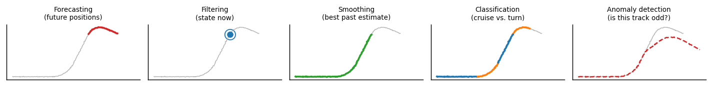

```
Author: Cfir Hadar

Tags: Done
```
# Lesson 01 - Problem Types & Objectives

## Motivation

Most failed time-series projects fail before any modeling: the problem was posed wrong. "Predict
the track" is not a task — it is five different tasks with five different evaluation targets, five
different data-splitting rules, and five different definitions of success. This lesson is the
vocabulary you need to force that decision into the open on day one.

## The five framings

Take one dataset — a set of flight tracks, each a sequence of timestamped positions — and look at
what changes when the question changes.



| Framing | Question | Estimate | Uses data from | Typical objective |
| --- | --- | --- | --- | --- |
| **Forecasting** | Where will it be at $t+h$? | $p(x_{t+h}\mid z_{1:t})$ | past only | RMSE / pinball / CRPS at horizon $h$ |
| **Filtering** | Where is it *now*, given noisy sensors? | $p(x_t\mid z_{1:t})$ | past + present | state RMSE, NEES/NIS consistency |
| **Smoothing** | Where *was* it, knowing everything? | $p(x_t\mid z_{1:T})$ | past + future | reconstruction error |
| **Classification** | What kind of track / behaviour is this? | $p(y\mid z_{1:T})$ or $p(y \mid z_{1:t})$ | a whole track or a window | accuracy / F1 / AUC, per-class |
| **Anomaly detection** | Is this track unlike normal? | a score $s(z_{1:T})$ | a track vs. a corpus | PR-AUC under extreme imbalance, alerts-per-day at fixed recall |

Three questions separate them in practice:

1. **What information is legitimately available at decision time?** Smoothing sees the future;
   filtering does not. Using a smoother's output as a filter's feature is the single most common
   leak in tracking pipelines.
2. **What is the deliverable — a point, a distribution, or a decision?** If a controller acts on
   your output, the loss is the controller's loss, not RMSE.
3. **What is the unit of evaluation?** A time step, a track, a segment, or an alert? This
   determines the split (Chapter 1, Lesson 03) and the metric denominator.

## Point vs. distribution vs. decision loss

A point forecast minimising squared error returns the **conditional mean**; minimising absolute
error returns the **median**; minimising the pinball loss at level $\tau$ returns the
$\tau$-**quantile**. Your metric silently chooses which functional you are estimating:

$$
\hat x = \arg\min_{a}\ \mathbb{E}\big[L(x,a)\big] \quad\Longrightarrow\quad
L=\text{squared}\Rightarrow \text{mean},\;\; L=\text{absolute}\Rightarrow \text{median}.
$$

For trajectories the mean is often the *worst* answer: an aircraft that will turn left or right
with equal probability has a conditional mean going straight — a path it will never fly. This is
the multi-modality problem, and it recurs in Chapter 6 (distributions) and Chapter 7 Lesson 03
(multi-modal futures).

Decision losses are usually **asymmetric and thresholded**: separation minima, collision risk,
fuel reserve. Under an asymmetric loss the optimal action is a quantile, not a mean, and a model
with worse RMSE can be strictly better for the decision.

## Worked mapping: one dataset, five projects

Dataset: 10,000 flight tracks, 1 Hz, position + noisy velocity, some with gaps.

* **Forecasting** — 60 s-ahead position; train on tracks up to a cutoff date, test after it; metric: horizon-wise CRPS; baseline: constant-velocity extrapolation.
* **Filtering** — real-time state from raw sensor returns; evaluate against smoothed "truth" on held-out tracks; metric: RMSE *plus* consistency (are the covariances honest?); baseline: a constant-velocity Kalman filter.
* **Smoothing** — reconstruct a clean archive; metric: reconstruction error on artificially corrupted tracks; baseline: RTS smoother.
* **Classification** — cruise vs. maneuver per 30 s window; split *by aircraft*, never by window; metric: per-class F1; baseline: turn-rate threshold.
* **Anomaly detection** — flag unusual tracks for an analyst; no labels; metric: precision at the top-50 alerts, estimated by stratified sampling; baseline: negative log-likelihood under a constant-velocity model.

Note that the same raw data supports all five, and that **the baseline changes with the framing**.
Writing this table for your own problem is the deliverable of Chapter 0.

## Assumptions & failure modes

| Assumption you are making | How it breaks | Symptom |
| --- | --- | --- |
| The framing matches the decision the output feeds | Team ships a forecaster where a filter was needed | Great offline numbers, useless in real time |
| Information available offline = available at decision time | Future context, smoothed features, post-hoc labels | Metrics degrade catastrophically in production |
| A point estimate summarises the answer | Multi-modal futures, heavy tails | Predictions that are physically impossible |
| The evaluation unit is the time step | Correlated steps within a track inflate $n$ | Confidence intervals far too narrow |

**Lens check:** this lesson is lens 2 (evaluation) applied *before* modeling, and it decides which
representation (lens 1) is even admissible.

## Next

[Lesson 02 - Baselines & Sanity Checks](L02_baselines.md)
