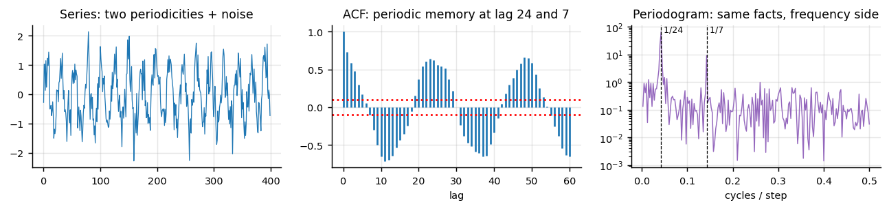

```
Author: Cfir Hadar

Tags: Done
```
# Lesson 02 - ACF/PACF & the Spectral View as Diagnostics

## Motivation

The classical use of ACF/PACF — reading off $p$ and $q$ for an ARMA model — is largely obsolete;
information criteria and cross-validation do it better. The *diagnostic* use is not obsolete at
all. ACF, PACF and the periodogram are the cheapest instruments you own for answering: how far back
does memory reach, is there periodicity, is my sampling rate lying to me, and did my model leave
structure on the table?

## The two functions

**Autocorrelation** $\rho(h)=\gamma(h)/\gamma(0)$, estimated by

$$
\hat\rho(h)=\frac{\sum_{t=1}^{T-h}(x_t-\bar x)(x_{t+h}-\bar x)}{\sum_{t=1}^{T}(x_t-\bar x)^2},
$$

with the white-noise band $\pm 1.96/\sqrt{T}$ — bars inside it are noise. **Partial
autocorrelation** $\phi_{hh}$ is the correlation between $x_t$ and $x_{t+h}$ *after removing* the
linear effect of the intermediate lags: the marginal information a lag adds.

Read them as a pair:

| Pattern | Suggests |
| --- | --- |
| ACF decays geometrically, PACF cuts off after lag $p$ | AR($p$)-like memory |
| ACF cuts off after lag $q$, PACF decays | MA($q$)-like (a short shock filter) |
| ACF decays very slowly, nearly linearly | non-stationary — trend or unit root, not "long memory" |
| ACF spikes at $m,2m,3m,\dots$ | seasonality with period $m$ |
| ACF of *residuals* has structure | model misspecified — something is left to learn |



## Why linear models on stationary series work at all: Wold

**Wold's decomposition.** Any covariance-stationary process can be written as

$$
x_t=\underbrace{\sum_{j\ge0}\psi_j\varepsilon_{t-j}}_{\text{linear in past white noise}}+\underbrace{v_t}_{\text{deterministic}},\qquad \psi_0=1,\ \sum\psi_j^2<\infty .
$$

So every stationary process has an MA($\infty$) representation, and ARMA models are finite
approximations to it. That is the license for linear time-series modeling — and its limit: Wold
guarantees only the *best linear* predictor. Nonlinear dependence (regimes, thresholds,
maneuvers) is entirely invisible to $\rho(h)$. A series can have zero autocorrelation at every lag
and be perfectly predictable nonlinearly.

## The spectral view

The spectral density is the Fourier transform of the autocovariance,

$$
S(f)=\sum_{h=-\infty}^{\infty}\gamma(h)\,e^{-2\pi i f h},
$$

with the periodogram $\hat S(f_k)=\frac{1}{T}\big|\sum_t (x_t-\bar x)e^{-2\pi i f_k t}\big|^2$ as
its raw estimate (noisy — smooth it, or use Welch's averaged version, before believing a peak).
Nothing new is in it: same second-order information, better questions.

* **Periodicity detection**: a peak at $f$ means a cycle of period $1/f$. Multiple periods that
  make an unreadable ACF are separated peaks in the spectrum.
* **Aliasing**: sampling at $\Delta t$ can only represent frequencies below the Nyquist limit
  $f_N=1/(2\Delta t)$. Anything faster is *folded* back and appears as a slow, entirely fictitious
  cycle. A 1 Hz rotor vibration sampled at 1.2 Hz becomes a convincing 0.2 Hz "oscillation" you
  can spend a week explaining.
* **Sensor artifacts**: a spike at exactly the sampling rate divided by a small integer, or at
  mains frequency, is hardware, not physics. Discrete-time quantisation, dropped-and-interpolated
  samples, and re-sampling filters all leave recognisable spectral signatures.
* **Scale separation**: the low-frequency mass tells you how much of the variance a long-horizon
  forecast could ever explain.

For trajectories, apply spectral thinking to *derived* series (speed, turn rate, altitude rate)
rather than raw position: position is dominated by the trend, and its spectrum is a $1/f^2$ ramp
that hides everything of interest.

## Assumptions & failure modes

| Assumption | How it breaks | Symptom | Response |
| --- | --- | --- | --- |
| Series is stationary | trend / regime shift | ACF decays slowly; spectrum dominated by $f\approx0$ | transform first (L01), or compute per segment |
| Dependence is second-order | nonlinear dynamics, regimes | flat ACF but predictable series | nonlinear diagnostics: ACF of $x_t^2$, mutual information |
| Uniform sampling | dropouts, jitter | invalid FFT, phantom peaks | Lomb-Scargle, or resample honestly (Ch.3 L01) |
| Peak = physical cycle | aliasing, leakage, mains hum | period suspiciously close to $\Delta t$ multiples | check Nyquist; window the data; verify at another sampling rate |
| Bars outside the band are real | multiple testing over 40 lags | ~2 "significant" lags by chance at $T$ large | use a joint test (Ljung-Box) for residual whiteness |

**Lens check:** lens 1 (what temporal structure exists to represent) and lens 3 (aliasing and
nonlinearity are assumption failures your plots can catch).

## Next

[Lesson 03 - Evaluation for Temporal Data](L03_temporal_evaluation.md)
