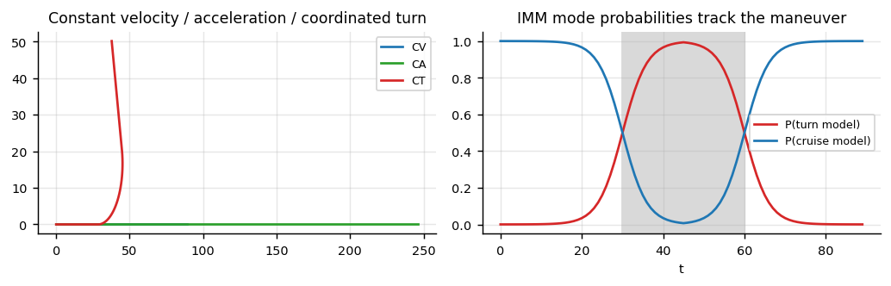

```
Author: Cfir Hadar

Tags: Done
```
# Lesson 03 - Motion Models & Maneuvering Targets

## Motivation

Filter performance on real tracks is dominated by $F$ and $Q$ — by what you claim the target can
do — far more than by whether you chose EKF or UKF. A constant-velocity filter tuned tightly enough
to smooth cruise noise will lag badly in a 3 g turn; loosened enough to follow the turn, it stops
smoothing anything. That tension is the subject of this lesson, and IMM is the principled way out.

## The standard motion models



**Constant velocity (CV)** — state $(p,\dot p)$, per axis:

$$
F=\begin{pmatrix}1&\Delta t\\0&1\end{pmatrix},\qquad
Q=\sigma_a^2\begin{pmatrix}\tfrac{\Delta t^4}{4}&\tfrac{\Delta t^3}{2}\\[2pt]\tfrac{\Delta t^3}{2}&\Delta t^2\end{pmatrix}
$$

(the discretised white-acceleration model). $\sigma_a$ is the *maneuver budget*: set it to the
plausible unmodelled acceleration — a rule of thumb is $\sigma_a\approx\tfrac12 a_{\max}$ for a
platform that maneuvers occasionally.

**Constant acceleration (CA)** — state $(p,\dot p,\ddot p)$, $F$ the corresponding Taylor matrix.
Better through sustained accelerations, worse in steady cruise: the extra state absorbs noise and
produces jittery velocity estimates. Do not reach for CA reflexively.

**Coordinated turn (CT)** — the aviation-relevant one. Constant speed, constant turn rate $\omega$,
state $(p_x,\dot p_x,p_y,\dot p_y)$:

$$
F(\omega)=\begin{pmatrix}
1&\frac{\sin\omega\Delta t}{\omega}&0&-\frac{1-\cos\omega\Delta t}{\omega}\\
0&\cos\omega\Delta t&0&-\sin\omega\Delta t\\
0&\frac{1-\cos\omega\Delta t}{\omega}&1&\frac{\sin\omega\Delta t}{\omega}\\
0&\sin\omega\Delta t&0&\cos\omega\Delta t
\end{pmatrix}
$$

(as $\omega\to0$ this tends to CV — implement the limit explicitly to avoid dividing by zero).
$\omega$ can be fixed per model, or estimated by augmenting the state — which makes the model
nonlinear and sends you to the EKF/UKF of Lesson 02.

**Choosing from domain knowledge.** A commercial aircraft in cruise: CV with small $\sigma_a$; bank
angles are limited, so plausible $\omega$ values are bounded by $\omega = g\tan\phi/v$ — for
$\phi\le25^\circ$ and $v=250$ m/s that is $\le0.019$ rad/s. Use that to pick the CT models in your
bank rather than guessing. The same logic applies to any platform with known kinematic limits: the
physics fixes the model set.

## Single-model adaptations (know them, they are often enough)

* **Adaptive $Q$**: inflate $\sigma_a$ when NIS exceeds its $\chi^2$ threshold, decay it back
  afterwards. Crude, cheap, surprisingly effective.
* **Input estimation / variable-dimension filters**: detect a maneuver, then switch to a
  higher-order model.
* Both are heuristic switches with a hard decision. IMM is the soft, probabilistic version — and
  is usually better behaved.

## IMM — interacting multiple models

Model the mode as a Markov chain $m_t\in\{1..M\}$ with transition matrix $\Pi$, $\pi_{ij}=P(m_t=j\mid m_{t-1}=i)$,
and run one filter per mode. Exact inference would require $M^T$ hypotheses; IMM keeps $M$ by
*mixing* at the start of each cycle. One cycle:

1. **Mixing.** Compute mixing weights $\mu_{i|j}=\pi_{ij}\mu_i/\bar c_j$ and form, for each model
   $j$, a merged prior $\hat x^{0j}=\sum_i\mu_{i|j}\hat x^i$, with the covariance including the
   spread-of-means term $\sum_i \mu_{i|j}\big[P^i+(\hat x^i-\hat x^{0j})(\cdot)^\top\big]$.
2. **Filtering.** Run each model's Kalman step from its mixed prior.
3. **Mode update.** $\mu_j\propto\bar c_j\,\Lambda_j$, where the likelihood
   $\Lambda_j=\mathcal N(\tilde y^j;0,S^j)$ comes free from each filter (L01).
4. **Output.** $\hat x=\sum_j\mu_j\hat x^j$, with the analogous mixture covariance.

Interpretation: **the mode probabilities are a maneuver detector you get for free** — plot
$\mu_j(t)$ and you see the turn begin and end. They are also a useful feature for the
classification and anomaly chapters.

**Design choices that matter.**

* *Model set*: 2-3 models, e.g. CV(small $Q$) + CV(large $Q$), or CV + CT($+\omega$) + CT($-\omega$).
  More models is not better — they compete for probability mass and each dilutes the others.
* *Transition matrix*: diagonal-heavy, $\pi_{ii}\approx0.9$-$0.99$. The off-diagonals encode the
  expected maneuver rate: with $\Delta t=1$ s, $\pi_{ij}=0.01$ says "a mode change roughly every
  100 s". Derive it from mean sojourn time $1/(1-\pi_{ii})$ rather than by fiddling.
* The mixing step is what makes it IMM rather than a static bank of filters; skipping it (a "GPB1"
  style average) loses the mode-conditioned history and performs visibly worse through transitions.

## Assumptions & failure modes

| Assumption | Breaks when | Symptom | Response |
| --- | --- | --- | --- |
| Motion is in the model set | unmodelled maneuver class (e.g. sharp dive) | all $\mu_j$ mediocre; NIS high for every model | add a model; widen $Q$ |
| Mode switching is Markov with known $\Pi$ | maneuvers depend on context/intent | sluggish or twitchy mode probabilities | tune $\pi_{ii}$ from observed sojourn times |
| One mode active at a time | slow blended maneuvers | probabilities hover at 50/50 | acceptable — the mixture output is still fine |
| $\Delta t$ constant | irregular sampling | $F,Q$ silently wrong | recompute $F(\Delta t),Q(\Delta t)$ per step (Ch.3 L01) |
| Extra models are harmless | over-large model set | mode probabilities diffuse, output degrades | prune to the physically motivated set |

**Lens check:** lens 1 (a regime *is* the temporal representation here) and lens 3 (IMM is an
explicit mechanism for detecting that a single model's assumptions broke).

## Next

[Lesson 04 - Multi-Target Essentials](L04_multi_target.md)
