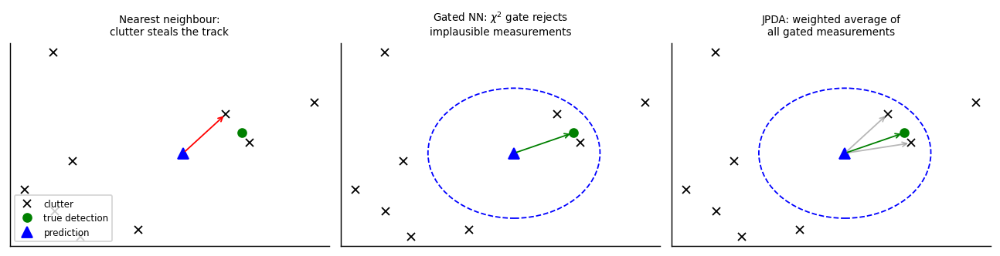

```
Author: Cfir Hadar

Tags: Done
```
# Lesson 04 - Multi-Target Essentials

## Motivation

With one target and one detection per scan, filtering is the whole problem. With several targets,
missed detections and clutter, a new question dominates: **which measurement belongs to which
track?** Association errors are unrecoverable in a way that estimation errors are not — a filter
that swaps two tracks produces confidently wrong output forever after. This lesson covers the
minimum you need to reason about that, plus the metric that keeps you honest.

## The setting

Per scan you receive a *set* of measurements. Each is either a detection of a known target
(with detection probability $P_D<1$), a detection of a new target, or clutter (false alarms, often
modelled as a Poisson process with density $\lambda$ per unit volume). Order carries no
information. That is what makes this different from ordinary estimation: the observation is a set,
not a vector.



## The association ladder

**Gating first, always.** Accept measurement $z$ for track $i$ only if

$$
d^2 = \tilde y^\top S^{-1}\tilde y \le \gamma,\qquad \gamma \text{ from } \chi^2_m .
$$

$\gamma$ for $m=2$ at 99 % is 9.21. Gating is cheap, removes most clutter, and bounds the
combinatorics of everything downstream. The gate size comes from $S$ — which means a badly tuned
$Q$ or $R$ (Lesson 01) produces a badly sized gate and thus association errors that look like
tracking errors.

**Nearest neighbour (NN).** Assign the closest gated measurement (by Mahalanobis distance) to each
track. Fast, and fine when targets are well separated and clutter is sparse. Fails exactly when it
matters: in dense clutter one false alarm nearer than the true detection captures the track, and
the filter then confidently follows noise.

**Global nearest neighbour (GNN).** Minimise total assignment cost over the whole scan, subject to
one measurement per track and one track per measurement — a rectangular assignment problem solved
in $O(n^3)$ by the Hungarian / auction algorithm. Strictly better than greedy NN, still a *hard*
decision: it commits, and a wrong commitment is permanent.

**JPDA (joint probabilistic data association).** Do not commit. Enumerate feasible joint
association events $\theta$, compute their probabilities, and update each track with the
probability-weighted combination of its gated measurements:

$$
\hat x_i = \hat x_{i|i-1} + K_i\sum_{j} \beta_{ij}\,\tilde y_{ij},
$$

where $\beta_{ij}=P(\text{measurement } j \text{ belongs to track } i\mid Z)$ and $\beta_{i0}$ is
the probability that none does. The covariance gets an extra spread term to reflect the
association uncertainty — this is the part people forget, and without it JPDA is over-confident.
Excellent in clutter; its known weakness is **track coalescence**: two nearby tracks share
measurements, merge, and refuse to separate.

**MHT — the concept.** Keep a *tree of hypotheses* over time instead of resolving ambiguity now:
each node is an association decision, each path a global hypothesis with a score. Ambiguity that is
unresolvable in the current scan is often trivial two scans later, so MHT defers the decision and
lets evidence accumulate. The whole engineering problem is that the tree explodes: pruning,
$N$-scan sliding-window resolution, hypothesis merging, and $k$-best assignment enumeration exist
solely to keep it finite. Know it as *deferred decision-making under association ambiguity*; that
concept is what transfers. (Random-finite-set methods — PHD/CPHD filters — are a different, elegant
formulation of the same problem; out of scope here.)

## Track lifecycle

An unmanaged tracker fills up with garbage tracks. The standard policies:

* **Initiation**: $M$-of-$N$ logic (e.g. 2 of 3 scans with gated detections) starting from
  unassociated measurements; two measurements give a velocity estimate for the tentative track.
  Tighter $M/N$ → fewer false tracks, slower to pick up real ones.
* **Confirmation / deletion**: a score-based test, typically the sequential probability ratio test
  on the log-likelihood ratio of "target present" vs. "clutter", or simply "delete after $k$
  consecutive misses". Under $P_D=0.9$, three consecutive misses has probability $10^{-3}$ per
  scan — a defensible threshold.
* Every one of these knobs trades **false tracks** against **track fragmentation** (one true
  target represented as several short tracks). Report both; a tracker tuned to look clean by
  fragmenting is a common self-deception.

## Evaluating a *set* of tracks: OSPA

Standard errors do not apply when estimates and truth are sets of different sizes: you must charge
for both localisation error and cardinality error. **OSPA** (optimal sub-pattern assignment) does
that in one number. For sets $X$ (truth, $|X|=m$) and $Y$ (estimates, $|Y|=n$), $m\le n$, with
cutoff $c$ and order $p$:

$$
\mathrm{OSPA}_{p,c}(X,Y)=\left(\frac{1}{n}\Big[\min_{\pi}\sum_{i=1}^{m}d_c(x_i,y_{\pi(i)})^p+c^p\,(n-m)\Big]\right)^{1/p},
\qquad d_c=\min(d,c).
$$

Read it as: optimally match what you can (that is the assignment problem again), charge the
distance for matched pairs, and charge a flat penalty $c$ for each unmatched estimate or missed
target. Two design choices carry meaning — $c$ **is the exchange rate** between "how far off" and
"how many wrong", and $p$ sets outlier sensitivity. Complementary metrics: CLEAR-MOT (MOTA/MOTP)
and, importantly, **identity switches**, which OSPA per-scan does not see at all; OSPA-on-tracks
variants exist for that.

## Assumptions & failure modes

| Assumption | Breaks when | Symptom | Response |
| --- | --- | --- | --- |
| One measurement per target per scan | extended targets, split/merged returns, resolution limits | tracks jitter between returns | extended-target models; cluster measurements first |
| Clutter is uniform Poisson | structured false alarms (terrain, multipath) | recurring false tracks in fixed places | spatially varying $\lambda$; maps/masks |
| $P_D$ known and constant | occlusion, aspect-dependent detection | over-eager deletion | estimate $P_D$ from data; longer deletion window |
| Gate size correct | mis-tuned $Q,R$ | true detection outside the gate → lost track | fix filter consistency first (L01 NIS) |
| Associations are independent across scans | dense targets, crossings | identity swaps, coalescence | JPDA with spread term; MHT-style deferral; report ID switches |

**Lens check:** lens 2 (OSPA and the false-track/fragmentation trade-off are the evaluation story)
and lens 3 (multi-modality caused by association is *the* assumption failure here — a single
Gaussian cannot represent "it is either this one or that one").

## Walkthrough

[Maneuvering Target with Clutter](../walkthroughs/lesson_maneuvering_target.ipynb)

## Available Challenges

[Challenge 01 - Sensor Fusion with Non-Gaussian Noise](../challenges/challenge1_nongaussian_fusion.ipynb)
