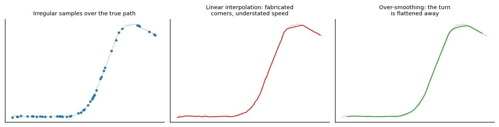

```
Author: Cfir Hadar

Tags: Done
```
# Lesson 01 - Irregular Sampling, Dropouts, Resampling

## Motivation

Textbook time series arrive on a uniform grid. Track data does not: reports come at irregular
intervals, drop out for a minute behind terrain, arrive out of order, duplicate, and occasionally
land with the wrong timestamp. What you do about that determines which models are even usable
downstream — and quietly manufactures artifacts that later look like discoveries.

## Three honest options



| Option | What it says | Good for | Damage |
| --- | --- | --- | --- |
| **Interpolate onto a grid** | "between samples the target did the simplest thing" | anything that needs uniform input: FFT, CNN, most DL | fabricates data with no uncertainty attached; corners at sample points; systematically *underestimates* path length and speed |
| **Model-based smoothing** (Kalman/RTS with $\Delta t$-dependent $F,Q$) | "propagate the dynamics; gaps just widen the covariance" | tracks, anything kinematic | needs a motion model; still an estimate — but one that reports its own uncertainty |
| **Leave gaps explicit** | "I do not know, and the model should know that" | attention/GRU-D-style models, tree models with gap features, event-based methods | fewer models accept it; more engineering |

The default in tracking work should be the middle one: a Kalman filter with per-step $\Delta t$ is
*the* principled resampler, and it hands you $P_t$ so downstream code knows which points were
guessed. Interpolate only when a model demands a grid, and carry a `is_interpolated` /
`gap_length` column with the data forever afterwards.

## How resampling interacts with dynamics

* **Oversmoothing.** A smoothing window longer than the maneuver flattens turns into gentle
  curves. Turn-rate features computed afterwards will show that this platform never maneuvers.
* **Fabricated sharp turns.** Linear interpolation across a 60 s gap produces a straight leg and
  two corners at its ends. Curvature and turn-rate features then spike *exactly at gap
  boundaries* — a beautifully reproducible artifact that correlates with terrain, weather, or
  whatever caused the dropout. This is how leakage sneaks into anomaly detection: the detector
  learns to find data-collection failures.
* **Aliasing.** Downsampling below twice the fastest real motion folds it into slow fictitious
  oscillations (Ch.1 L02). Before choosing a grid, ask what the shortest maneuver you care about
  is and sample at 5-10 points across it.
* **Speed bias.** Under linear interpolation $\|\hat p_{t+1}-\hat p_t\|\le$ true path length: the
  coarser the grid, the slower and straighter every track appears. If you compare tracks from
  sensors with different rates, you are comparing sensors, not platforms.
* **Timestamp pathologies.** Out-of-order arrivals (sort by time, do not assume), duplicates
  (deduplicate on (id, time), keep the better-quality report), clock offsets between sensors
  (estimate the offset — or augment the state with it), and time zones/leap seconds. Always work
  in a monotone, UTC-based, integer-epoch time axis.

## Practical recipe

1. Sort by time; drop exact duplicates; flag and inspect out-of-order and $\Delta t\le0$ records.
2. Compute the $\Delta t$ histogram. It tells you the nominal rate, the dropout structure, and
   whether "1 Hz data" is actually 1 Hz.
3. Split a recording into segments at gaps longer than a threshold derived from your dynamics
   (e.g. longer than the time to complete the smallest maneuver of interest). Do **not** bridge
   those; a bridged gap is a fabricated leg.
4. Within segments, use the filter/smoother at native timestamps ($F(\Delta t),Q(\Delta t)$
   recomputed per step — this is the correct handling of irregular sampling, not an approximation).
5. If a uniform grid is required, resample *from the smoother's output*, and keep the covariance
   and gap flags as features.
6. Re-check: does the resampled track's speed/turn-rate distribution match the raw one? Any large
   discrepancy is your artifact budget.

## Assumptions & failure modes

| Assumption | Breaks when | Symptom | Detection |
| --- | --- | --- | --- |
| Sampling is missing-at-random | dropouts correlate with terrain, maneuvers, jamming, low altitude | interpolated segments differ systematically from observed ones | model the gap indicator as a target: if it is predictable, it is informative |
| Interpolated points are as good as real ones | any interpolation | over-confident downstream models; artifacts at gap edges | keep and use the `is_interpolated` flag; ablate by dropping interpolated rows |
| $\Delta t$ is constant | irregular reports | $F,Q$ (and any lag feature) wrong | assert on the $\Delta t$ histogram |
| Grid choice is a detail | too coarse | aliasing, speed bias, vanished maneuvers | recompute features at two rates and compare |

**Lens check:** lens 1 (the sampling grid *is* a representation decision) and lens 3 (dropouts are
a data-generating-process assumption that breaks constantly).

## Next

[Lesson 02 - Coordinate Frames & Kinematic Features](L02_frames_and_features.md)
