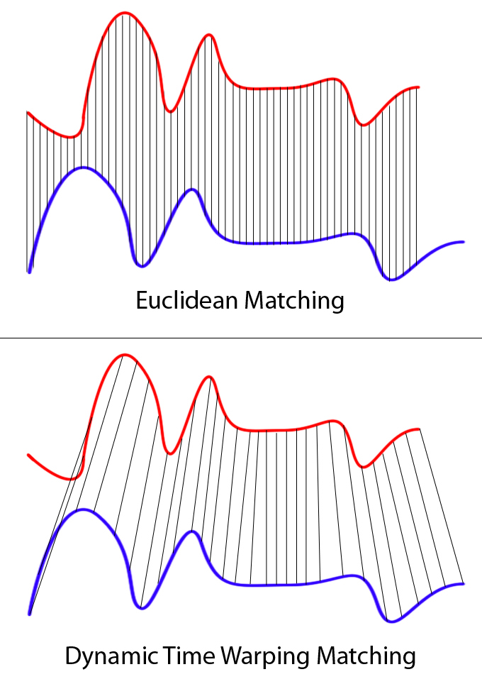
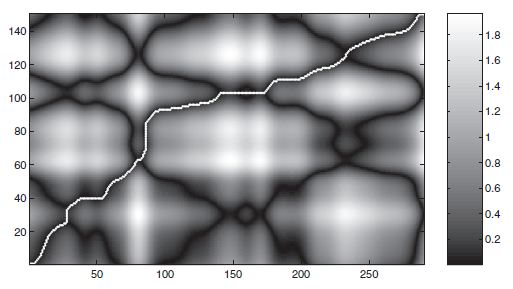

```
Author: Cfir Hadar

Tags: Done
```
# Lesson 01 - Distance-Based & Feature-Based Classification

## Motivation

Time-series classification has an unusual literature: it is dominated by large, careful bake-offs
in which simple methods keep winning. The two families in this lesson — "compare whole series with
an elastic distance" and "summarise the series into features, then use ordinary ML" — are between
them the honest baselines you must beat before any deep model is worth discussing.

## Why Euclidean distance is not enough

Two recordings of the same maneuver, one executed slightly slower, have large point-wise distance
at every lag. Euclidean distance requires alignment you do not have. **Dynamic time warping** finds
the alignment.



*Rigid index-to-index matching vs. elastic alignment. Source:
[Euclidean vs DTW](https://commons.wikimedia.org/wiki/File:Euclidean_vs_DTW.jpg) by XantaCross,
CC BY-SA 3.0, via Wikimedia Commons.*

Given $a_{1:n}$, $b_{1:m}$, define the accumulated cost

$$
D(i,j)=d(a_i,b_j)+\min\{D(i-1,j),\;D(i,j-1),\;D(i-1,j-1)\},
$$

with $D(0,0)=0$ and $\infty$ on the other boundaries; $\mathrm{DTW}(a,b)=D(n,m)$, and backtracking
gives the warping path. Cost $O(nm)$.



*The accumulated cost matrix and the optimal path through it — the diagonal band is where a
Sakoe-Chiba constraint would confine it. Source:
[Cost matrix and dtw path](https://commons.wikimedia.org/wiki/File:Cost_matrix_and_dtw_path.jpg) by
Meinard Müller, copyrighted free use, via Wikimedia Commons.*

Variants worth knowing:

* **Sakoe-Chiba band / Itakura parallelogram** — constrain the path to stay within $w$ of the
  diagonal. This is not only a speed-up ($O(nw)$): a small band is usually *more accurate*, because
  unconstrained warping happily matches a short blip to a long segment. $w$ is a real
  hyperparameter, tuned by cross-validation; $w\approx 5\text{-}10\%$ of the length is a good start.
* **Derivative DTW (DDTW)** — warp on the derivative, avoiding the "singularity" pathology where
  one point maps to a whole flat run.
* **Soft-DTW** — replaces $\min$ with a soft-min, making DTW differentiable, hence usable as a
  loss for neural networks and for computing barycentres (averages of series).
* **LCSS / EDR / ERP** — edit-distance style measures, more robust to outliers and gaps; for
  *trajectories* specifically, LCSS handles dropouts better than DTW, and Fréchet distance is the
  geometry-aware alternative that respects the shape of the path rather than its timing.
* **Multivariate DTW**: *dependent* (warp all channels with one path — right when channels are
  physically coupled, e.g. $x,y$ of one platform) vs. *independent* (warp per channel and sum —
  right when channels are unrelated). This choice matters and is frequently made by accident.

**kNN-DTW (usually 1NN) is the field's honest baseline.** It is nonparametric, has essentially one
hyperparameter, and for decades was hard to beat. Its costs are real: $O(N n^2)$ per query at
prediction time (mitigated by lower bounds — LB_Keogh — and early abandoning), no probabilistic
output worth calibrating, and it requires the series to be commensurable (same channels, similar
lengths, sensible normalisation — z-normalise per series unless amplitude is the signal).

## Feature-based classification

Map each series to a fixed-length vector, then use any tabular classifier. Three levels:

1. **Manual kinematic features** (Ch.3 L02): speed and turn-rate quantiles, straightness, climb
   statistics, segment counts, dwell times. Interpretable, cheap, domain-aligned, and the version
   a domain expert can argue with — which is worth more than a point of accuracy.
2. **catch22** — 22 features selected from thousands (the `hctsa` library) for being individually
   informative and mutually non-redundant across a large benchmark corpus: distribution shape,
   autocorrelation structure, entropy, outlier statistics, stationarity summaries. A strong,
   fast, fixed representation with no tuning.
3. **tsfresh** — computes hundreds to thousands of features, then filters them by univariate
   significance tests with FDR control. Powerful and dangerous: with thousands of candidate
   features and a modest sample size, the selection step *must* live inside the CV fold, or you
   have leaked (Ch.1 L03).

Pair any of these with a random forest, gradient boosting, or a linear model. For trajectory work
this pipeline is very often the production answer: fast at inference, trivially explainable,
robust to irregular sampling and missing data — precisely the conditions where DTW struggles.

## Which to reach for

| Situation | Prefer |
| --- | --- |
| Class differences are in *shape*, timing varies | DTW-based |
| Class differences are in *statistics* (speed, variability, periodicity) | feature-based |
| Irregular sampling, gaps, unequal lengths | feature-based (or LCSS) |
| Small $N$, few classes | 1NN-DTW — hard to beat, nothing to overfit |
| Large $N$, latency budget at inference | feature-based or ROCKET (L02) |
| Need explanations for an operator | manual kinematic features |

## Assumptions & failure modes

| Assumption | Breaks when | Symptom | Response |
| --- | --- | --- | --- |
| Warping is legitimate | timing *is* the class signal | DTW erases exactly what distinguishes the classes | band-constrain, or use Euclidean/features |
| Series are commensurable | different sampling rates, lengths, units | distances dominated by artifacts | resample per Ch.3 L01; z-normalise deliberately |
| z-normalisation is harmless | amplitude carries the class | accuracy collapses vs. raw | ablate: with and without |
| Features summarise what matters | ordering is the signal | feature pipeline plateaus well below DTW | add order-sensitive features, or change family |
| Feature selection is preprocessing | selection on all data | optimistic CV, gap on the test set | select inside the fold |

**Lens check:** lens 1 (elastic alignment vs. summary statistics are two representations of the
same series) and lens 2 (baselines and the leakage rules above).

## Next

[Lesson 02 - Random-Feature & Deep Classifiers](L02_rocket_and_deep.md)
