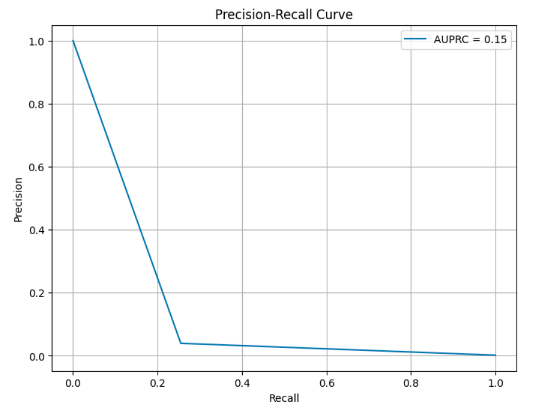

```
Author: Cfir Hadar

Tags: Done
```
# Lesson 01 - Framings & Evaluation Under Label Scarcity

## Motivation

Anomaly detection on tracks is where the three lenses collide. "Anomalous" is undefined until you
choose a normal-behaviour model (lens 1 and 3), labels barely exist (lens 2), and the base rate is
so low that the usual metrics are actively misleading. Building a detector takes an afternoon.
Defending its precision and recall is the actual job, and the deliverable of this chapter.

## First: which anomaly?

| Type | Example on tracks | Detected by |
| --- | --- | --- |
| **Point / spike** | one impossible position report | filter innovation gating (Ch.2 L01) |
| **Contextual** | normal speed — for a different phase of flight | model conditioned on context |
| **Collective / sequence** | a plausible-looking but unusual *pattern* of maneuvers | sequence likelihood, reconstruction |
| **Group / cardinality** | one track normal, five together are not | multi-target / spatial models |

Most projects say "anomalous track" and mean the third. Say which one out loud before choosing a
method — the four require different models and different evaluation units.

## Three framings

**1. Density / likelihood-based.** Fit a model of *normal* behaviour, score by negative
log-likelihood.

* A **Kalman/SSM** trained on normal tracks gives $-\log p(z_{1:T})=\tfrac12\sum_t[\log|2\pi S_t|+\tilde y_t^\top S_t^{-1}\tilde y_t]$ for free (Ch.2 L01). Beautifully interpretable: the score decomposes over time, so you can point at *when* the track became odd.
* A **Markov chain** over discrete segment labels (Ch.3 L03) scores unusual *sequences* of
  behaviours: $-\sum_t \log P(s_{t+1}\mid s_t)$.
* An **HMM** does the same with latent modes; an **IMM**'s mode probabilities are a ready-made
  feature ("this platform spent 40 % of its time maneuvering; normal is 5 %").
* Strength: calibrated-ish, decomposable, and it tells you which assumption the track violated.
  Weakness: it flags whatever is *rare*, and rare ≠ interesting. Sensor artifacts and data gaps are
  the rarest things in most datasets (Ch.3 L01) — expect them at the top of your alert list.

**2. Reconstruction-based.** Train an autoencoder (or seq2seq / LSTM-AE) on normal tracks; score by
reconstruction error. Flexible and handles high-dimensional multivariate input. Two known
pathologies: sufficiently expressive autoencoders reconstruct anomalies too (the score collapses),
and the error is not a probability — thresholds do not transfer between datasets. It is also
easily fooled by anything with unusual *scale* rather than unusual *shape*.

**3. Discriminative.** If you have even a few hundred labels, supervised classification
(or PU-learning: positive-unlabelled) beats unsupervised scoring nearly always. Do not skip this
option out of habit; "we have no labels" often means "nobody has spent two days labelling", which
is a far cheaper intervention than a better model.

Two more that are strong baselines and cheap: **isolation forest** on kinematic features, and
**kNN distance** in feature space. Run them before anything deep — and against a *time-aware*
protocol, not a random split.

## Evaluation is the hard part

With a base rate around $10^{-3}$:



*What a rare-event detector actually looks like: precision falls off a cliff within the first
quarter of recall, and the PR-AUC baseline is the base rate itself — not 0.5. Source:
[Precision Recall Curve](https://commons.wikimedia.org/wiki/File:Precision_Recall_Curve.png) by
Shiva Nagalla, CC0, via Wikimedia Commons.*

* **ROC-AUC is misleading.** A 0.95 AUC can still mean the operator drowns in false alarms, because
  the false-positive axis is dominated by the huge negative class. Use **PR-AUC** (whose baseline is
  the base rate itself) and, better, report the operating point you will actually run:
  **precision at $k$ alerts/day** or **recall at a fixed alert budget**.
* **Threshold selection** must come from a budget or a cost model, not from a quantile of the score
  on data you also evaluate on. State it: "the analyst team can process 50 alerts a day."
* **Point-adjusted F1**, common in the TS anomaly literature, is known to be badly inflated — a
  random scorer can score >0.8 under it. Do not use it; if you read a paper that does, discount the
  numbers.
* The **evaluation unit** must match the alert unit: per-track alerts are evaluated per track, not
  per time step.

## Label-efficient evaluation: the actual deliverable

You have 100k unlabelled tracks and a budget of 500 analyst labels. Do **not** label the top 500
scores — that estimates precision at the top only, and gives no information about recall.

**Stratified sampling with inverse-probability weighting.** Partition the score range into strata
(e.g. top 0.1 %, next 1 %, next 10 %, the rest), sample $n_h$ tracks from stratum $h$ of size $N_h$
with known sampling probability $\pi_h=n_h/N_h$, and estimate totals with Horvitz-Thompson:

$$
\widehat{TP}(\theta)=\sum_{h}\frac{1}{\pi_h}\sum_{i\in S_h} y_i\,\mathbb 1[s_i\ge\theta],
\qquad
\widehat{FN}(\theta)=\sum_h \frac{1}{\pi_h}\sum_{i\in S_h} y_i\,\mathbb 1[s_i<\theta],
$$

giving $\widehat{\mathrm{Prec}}=\widehat{TP}/(\widehat{TP}+\widehat{FP})$ and
$\widehat{\mathrm{Rec}}=\widehat{TP}/(\widehat{TP}+\widehat{FN})$ — **both** estimable, because the
low-score strata are sampled too. Allocate the budget so that high-score strata are sampled heavily
(they contain the positives) but no stratum is sampled at zero. Variance follows from the standard
stratified-sampling formula, or bootstrap within strata; report the interval, because with 500
labels and a $10^{-3}$ base rate it will be wide, and that is the honest answer.

Two more practical notes: labelling is noisy — have a fraction double-labelled and report
agreement; and keep the labelled sample *frozen* as an evaluation set, because reusing it while
iterating on the detector is the same overfitting you avoid everywhere else.

## Assumptions & failure modes

| Assumption | Breaks when | Symptom | Response |
| --- | --- | --- | --- |
| Training data is "normal" | anomalies contaminate it | the model learns them as normal; recall collapses | robust fitting, trimming, iterate with found anomalies |
| Rare = anomalous = interesting | artifacts, dropouts, rare-but-benign platforms | top alerts are all data-quality issues | filter artifacts first; define "interesting" with the user |
| Score threshold transfers | drift, new sensors, seasons | alert volume swings wildly | recalibrate on a rolling window; monitor alert rate |
| Base rate is stable | it never is | precision estimates go stale | re-estimate periodically; track drift |
| Labelled sample is representative | labelled only the top scores | recall unmeasurable, precision biased | stratified sampling + IPW, as above |

**Lens check:** all three — the normal-behaviour model is lens 1, label-scarce evaluation is lens 2,
and "rare ≠ anomalous" is lens 3.

## Available Challenges

[Challenge 01 - Flag Anomalous Tracks in Unlabeled Data](../challenges/challenge1_unlabeled_anomalies.ipynb)
