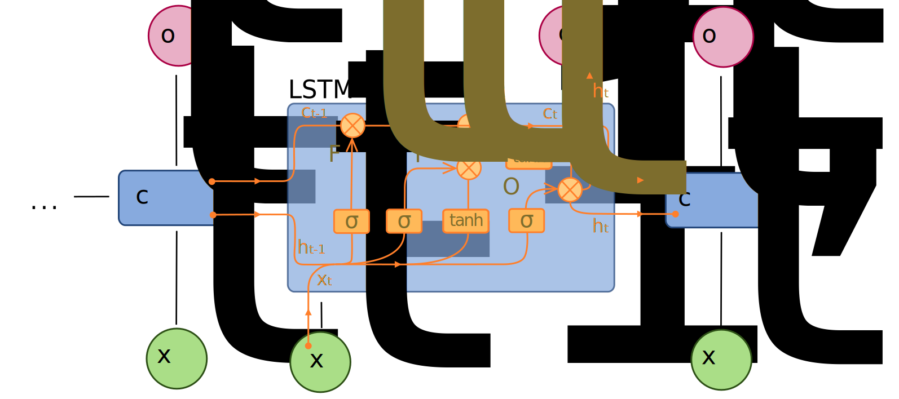

```
Author: Cfir Hadar

Tags: Done
```
# Lesson 01 - Compressed Sequence-Model Refresher

## Motivation

You have met RNNs, LSTMs and CNNs before. This lesson re-reads them through one question only:
**what does each architecture assume about time?** Choosing among them is choosing an inductive
bias, and the bias — not the parameter count — is what determines whether a model can represent
your problem.

## Organised by inductive bias

| Family | Memory | Causal? | Parallel in $t$? | Assumes |
| --- | --- | --- | --- | --- |
| **RNN / LSTM / GRU** | unbounded in principle, geometric in practice | yes | no (sequential) | recent past dominates; one fixed-size state suffices |
| **TCN / dilated 1D-CNN** | fixed receptive field | yes (causal padding) | yes | relevant context has bounded length; translation invariance |
| **Transformer** | full sequence | with masking | yes | any position may matter; needs positional encoding to know *when* |
| **State-space (S4/Mamba)** | long, structured | yes | yes (scan) | dynamics are (nearly) linear-recurrent; long-range with linear cost — Chapter 8 |

### Recurrent

$h_t=\sigma(W_hh_{t-1}+W_xx_t+b)$ is a nonlinear state-space model with a *learned* transition and
no uncertainty — compare Chapter 2 Lesson 01 term by term. Backpropagation through time multiplies
Jacobians, so gradients vanish or explode geometrically; **LSTM** fixes this with an additive cell
state and multiplicative gates (forget/input/output), **GRU** with two gates and fewer parameters
(usually equivalent, faster, a reasonable default).



*The additive cell state $c_t$ running straight across the top is the whole trick — it is a
gradient path that does not get multiplied by a Jacobian at every step. Source:
[Long Short-Term Memory](https://commons.wikimedia.org/wiki/File:Long_Short-Term_Memory.svg) by
fdeloche, CC BY-SA 4.0, via Wikimedia Commons.*

Practical properties: strictly sequential (slow to train, cheap and *stateful* at inference — a
genuine advantage for streaming/online tracking), naturally handles variable lengths and irregular
sampling if you feed $\Delta t$ as an input, and struggles beyond a few hundred steps of effective
memory.

### Convolutional / TCN

Stack causal convolutions with exponentially increasing dilation ($1,2,4,8,\dots$). The receptive
field is $R=1+2(k-1)(2^{L}-1)$ for kernel size $k$ and $L$ layers — **compute it before training**;
a model whose receptive field is shorter than the pattern it must detect cannot learn it, no matter
how long you train. Residual connections and weight normalisation make deep stacks trainable.

TCNs train in parallel, have stable gradients, and match or beat LSTMs on many sequence benchmarks.
Their bias — *local patterns at multiple scales, translation-invariant* — is exactly right for
maneuver signatures.

**Connection back to ROCKET** (Chapter 4 Lesson 02): ROCKET is a one-layer dilated convolution bank
with *random* weights and a linear head. A TCN is the same idea with learned weights and depth. The
comparison is informative: if random kernels match your trained TCN, the task's signal is in the
presence of multi-scale local patterns, and the learning was buying you very little.

### Attention, briefly

Self-attention has no built-in notion of time — permute the inputs and the output permutes with
them. All temporal structure comes from positional encodings and masking. That is maximum
flexibility and minimum prior, which is why transformers need more data and why the debate in
Lesson 02 exists at all.

## Choosing, and the parts everyone gets wrong

* **Normalisation dominates.** For nonstationary series, per-window instance normalisation
  (RevIN-style: subtract the window's mean and std, predict, then add them back) is frequently
  worth more than the entire architecture choice. Report the ablation — this is the single most
  common confound in published comparisons.
* **Loss = functional** (Ch.6 L01). MSE trains the conditional mean, which for multi-modal futures
  is the wrong object.
* **Direct vs. recursive multi-step.** Recursive (feed predictions back) accumulates error and
  suffers exposure bias; direct (one head per horizon) is more robust and usually better beyond a
  few steps; a single seq2seq decoder sits between them.
* **Teacher forcing** creates a train/test mismatch — a model that looks excellent in training and
  drifts in free-running rollout is exhibiting exactly this.
* **Input scaling and gaps.** Feed $\Delta t$, feed a missingness mask, and do not let the model
  learn your interpolation artifacts (Ch.3 L01).

## Assumptions & failure modes

| Assumption | Breaks when | Symptom | Response |
| --- | --- | --- | --- |
| Receptive field covers the pattern | long-range dependence, TCN too shallow | model plateaus at baseline | compute $R$; add dilation/layers |
| Fixed-size state suffices | long, multi-scale context | LSTM forgets; error grows with sequence length | attention, SSMs (Ch.8), or explicit features |
| Sampling is uniform | irregular tracks | the model learns the sampling pattern | feed $\Delta t$; resample deliberately |
| Series are stationary enough | drift between train and deployment | good backtest, poor live performance | instance normalisation; rolling retraining |
| Deep model needs no baseline | small $N$ (very common) | beaten by ridge/ROCKET/CV extrapolation | Ch.0 baselines first, always |

**Lens check:** lens 1 (inductive bias *is* a claim about temporal structure) and lens 3
(nonstationarity and irregular sampling break these models quietly).

## Next

[Lesson 02 - Transformer Forecasters & the DLinear Lens](L02_transformers_and_dlinear.md)
