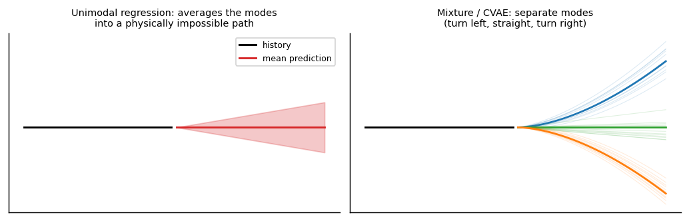

```
Author: Cfir Hadar

Tags: Done
```
# Lesson 03 - Trajectory Prediction Proper

## Motivation

Trajectory prediction is not univariate forecasting with two channels. The output is a *path* in
space, constrained by physics, shaped by interaction with other agents, and — the point that
organises this lesson — **fundamentally multi-modal**: at a junction the agent goes left or right,
and no amount of training data will make the average of those a valid prediction.

## Why it is a different problem

| Property | Consequence |
| --- | --- |
| Output is geometric (2D/3D positions over time) | errors are distances, not scalars; metrics are ADE/FDE, not RMSE per channel |
| Channels are physically coupled | independent per-axis models produce impossible paths |
| Physical constraints | bounded speed, bounded acceleration, bank/turn limits, terrain |
| Multi-agent | other agents' futures are part of the input *and* jointly uncertain |
| Multi-modal futures | the conditional mean is often outside the support of the true distribution |
| Long horizons matter | 3-10 s in driving; 1-10 min in air traffic; uncertainty grows superlinearly |



## Architecture families

**Seq2seq multi-step.** Encode the history (LSTM/TCN/transformer), decode $H$ future positions,
usually as *offsets* from the last observed point (predicting absolute coordinates makes the model
learn the map instead of the motion). Decode directly (one head per horizon) rather than
autoregressively where you can — see the exposure-bias note in Lesson 01.

**Mixture density networks (MDN).** Output the parameters of a $K$-component Gaussian mixture per
horizon, trained by negative log-likelihood:

$$
p(y\mid x)=\sum_{k=1}^{K}\pi_k(x)\,\mathcal N\big(y;\mu_k(x),\Sigma_k(x)\big),\qquad
\mathcal L=-\log\sum_k \pi_k\,\mathcal N(y;\mu_k,\Sigma_k).
$$

This is the most direct fix for multi-modality: modes get their own components and their own
covariances. Known difficulties — mode collapse (one component takes all the mass), numerical
instability (bound $\log\sigma$; use the log-sum-exp trick), and the fact that only the component
nearest the observed future receives gradient, which makes initialisation matter. The industrial
variant is *anchor / intention-based*: predict a distribution over a fixed set of candidate goals
or maneuver classes, then a trajectory per goal — more stable, and interpretable.

**CVAE-style generative models.** Learn $p(y\mid x)=\int p(y\mid x,z)p(z\mid x)dz$ with a latent
$z$ capturing intent; sample $z$ to draw plausible futures. Trajectron++ is the canonical
example. Gives diverse samples, but evaluation gets slippery: report **min-ADE over $k$ samples**
*and* a proper distributional score, because min-ADE alone rewards a model that scatters samples
everywhere.

**Interaction-aware models** (survey level). Social-LSTM (pooling neighbour states),
Social-GAN (adversarial multi-modality), Trajectron++ (graph over agents + CVAE), VectorNet and
LaneGCN (encode map and agents as polylines in a graph), and the current wave of transformer
scene encoders. The common structure: a **scene encoder** over agents (and map, where relevant) plus
a multi-modal decoder. For air/maritime domains the "map" is airways, procedures, sea lanes and
restricted zones — encode them; they are the strongest available prior.

**Physics-informed hybrids.** Predict *control inputs* (acceleration, turn rate) and integrate them
through a kinematic model rather than predicting positions directly. The output is then feasible by
construction, extrapolates sanely, and needs far less data. Related: use a learned model to correct
a Kalman/IMM prediction (residual learning) — usually the best accuracy-per-effort ratio in
practice, and a direct bridge back to Chapter 2.

## Metrics

* **ADE** — average displacement error over the horizon; **FDE** — final displacement error.
* **min-ADE$_k$ / min-FDE$_k$** — best of $k$ samples; standard in the AV literature, and easily
  gamed by diversity without calibration.
* **Miss rate** at a distance threshold — closer to an operational decision.
* **NLL / CRPS / energy score** — proper scores that penalise over-dispersion (Ch.6 L03).
* **Feasibility checks** — fraction of predictions violating speed/acceleration/turn limits, or
  entering forbidden regions. Report it; papers rarely do, and it is often where a model embarrasses
  itself.

Always compare against **constant velocity** (Ch.0 L02). In several AV benchmark studies a tuned CV
model beats a large share of published deep predictors at short horizons; in air traffic the same
holds during cruise. If your model does not beat CV over the horizon range you care about, you have
learned something valuable and cheap.

## Assumptions & failure modes

| Assumption | Breaks when | Symptom | Response |
| --- | --- | --- | --- |
| Unimodal output | junctions, holding patterns, evasive maneuvers | predictions cut corners / go straight through impossible regions | MDN, anchors, CVAE |
| Agents are independent | dense traffic, formation flight, deconfliction | colliding or physically inconsistent joint predictions | interaction encoders; joint (scene-level) prediction |
| Positions are the right output space | limited data, extrapolation | infeasible paths | predict controls, integrate through kinematics |
| Train scenarios cover deployment | new region, new procedures, rare maneuvers | silent degradation | test on a held-out *region*, not a random split |
| min-ADE$_k$ measures quality | uncalibrated diversity | great min-ADE, terrible NLL | report a proper score alongside |
| Horizon-averaged error suffices | risk concentrated at long horizon | per-horizon breakdown hidden | report error vs. horizon curves |

**Lens check:** all three — geometry and multi-modality are representation (lens 1), ADE/FDE vs.
proper scores is evaluation (lens 2), and "the mean is not a valid trajectory" is the assumption
failure this whole field exists to fix (lens 3).

## Walkthrough

[DLinear vs. Patch Models vs. a Classical Baseline](../walkthroughs/lesson_dlinear_vs_patch.ipynb)
